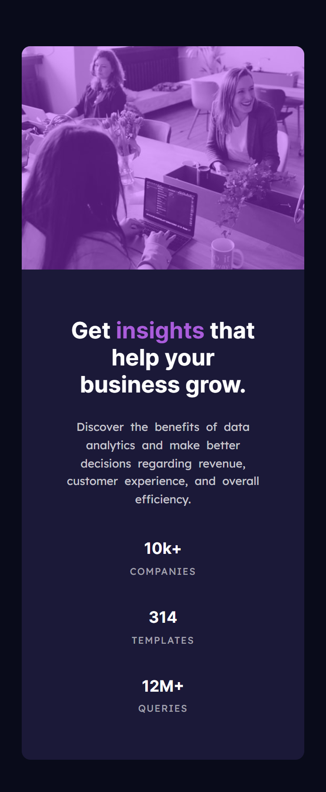

# Frontend Mentor - Stats preview card component solution

This is a solution to the [Stats preview card component challenge on Frontend Mentor](https://www.frontendmentor.io/challenges/stats-preview-card-component-8JqbgoU62). Frontend Mentor challenges help you improve your coding skills by building realistic projects. 

## Table of contents

- [Overview](#overview)
  - [The challenge](#the-challenge)
  - [Screenshot](#screenshot)
  - [Links](#links)
- [My process](#my-process)
  - [Built with](#built-with)
  - [What I learned](#what-i-learned)
  - [Continued development](#continued-development)
  - [Useful resources](#useful-resources)

**Note: Delete this note and update the table of contents based on what sections you keep.**

## Overview

### The challenge

Users should be able to:

- View the optimal layout depending on their device's screen size

### Screenshot




### Links

- Solution URL: [GitHub](https://github.com/hoomi88/stats-preview-card-component-main)
- Live Site URL: [Live URL](https://hoomi88.github.io/stats-preview-card-component-main/)

## My process

### Built with

- Semantic HTML5 markup
- CSS custom properties
- Flexbox

### What I learned

I have learned how to put a colored layer above image using background.

```html
<div class="my-image-background">
  <div class="my-image-color"></div>        
</div>
```
```css
.my-image-background{
  background: url("./images/image-header-desktop.jpg");    
  background-size: 100%;
  background-repeat: no-repeat;  
  position: relative; 
}
.my-image-color {            
    background-color: hsla(277, 100%, 61%, 0.45);
    position: absolute;    
}
```

I have also learned how to shift a flexbox direction to allow mobile reaady responsive design.

```html
<div class="card">
  <div class="content">       
  </div>
  <div class="my-image-background">        
  </div>
</div>
```
Desktop:
```css
.card {  
  display:flex;  
}
.content {  
  flex-grow:1;  
}
.my-image-background{  
  flex-grow:1;  
}
```
Mobile:
```css
@media only screen and (max-width: 375px) {
  .card {  
    display:flex;
    flex-flow: column;      
    flex-direction: column-reverse; 
  }
  .my-image-background{  
    flex:25vh;
  }
}
```

### Continued development

I need to keep learning how to control sizes, espcially image size, gaps between parts, etc.

### Useful resources

- [W3SCHOOLS](https://www.w3schools.com/) - A lot of information and examples of how to execute various CSS tricks.
- [MDN Web Docs](https://developer.mozilla.org/en-US/) - very good and detailed website, gives some examples.

